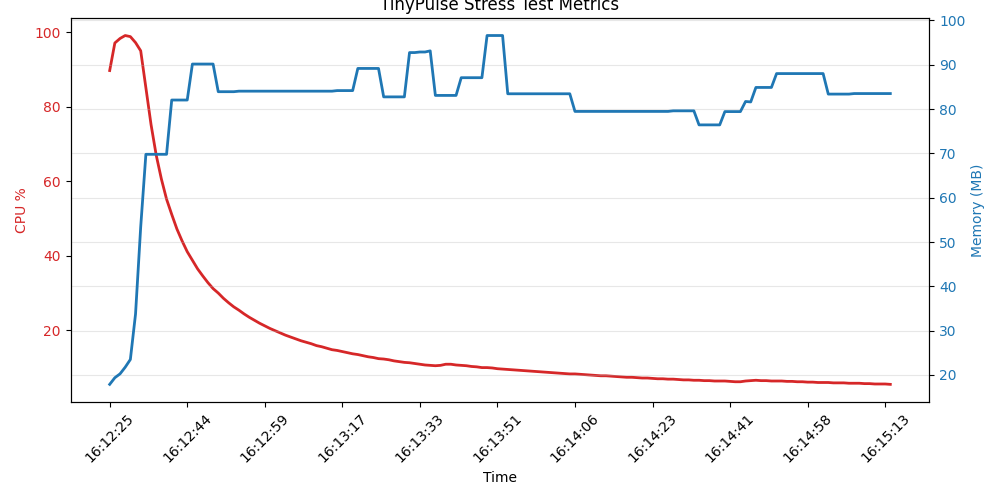

# Performance

Tested on the following environment with a pre-generated database of ~43200000 checks data (1000 dummy endpoints, 30 days of history, interval of 60 seconds) with total of 3.4G DB Storage.

```bash
# To run with constrants
systemd-run --user --scope \
    --unit=tinypulse-stress \
    -p CPUQuota=100% \
    -p MemoryMax=1G \
    -p MemorySwapMax=0 \
    ./tinypulse --addr 3000

# To read
systemd-cgtop -p /user.slice/user-$(id -u).slice/$(systemctl show --property ControlGroup --value tinypulse-stress.scope)
```

A quick chart.



Also. hydration only takes a couple seconds for this database size.
```bash
time=2026-04-21T16:12:25.614+08:00 level=INFO msg="hydrating state manager from database..."
time=2026-04-21T16:12:30.755+08:00 level=INFO msg="state manager hydrated successfully" endpoints=1000
time=2026-04-21T16:12:30.758+08:00 level=INFO msg="server starting" addr=:3000
```